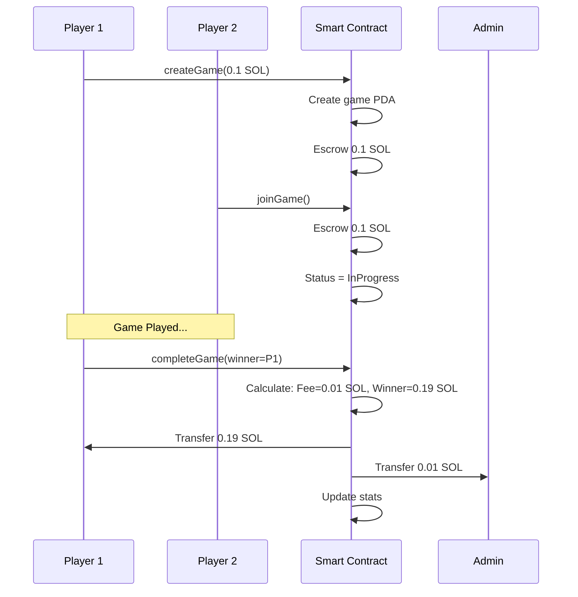

# Solana Integration Documentation

## Overview
This document describes how the Air Hockey game integrates with Solana blockchain for decentralized gaming with real SOL stakes.

## Architecture

### Smart Contract (Rust - Anchor Framework)
**Location**: `programs/escrow-fee/src/lib.rs`

**Program ID**: `3KzkUzoaSFt7xF9sW389YFE1JTwD5Fcu3aM9sReU4jgr`

**Network**: Solana Devnet (`https://api.devnet.solana.com`)

### Core Components

#### 1. **Platform State PDA**
Program Derived Address that stores platform configuration:
- Admin wallet address
- Fee percentage (5%)
- Total games played
- Total fees collected

```rust
#[account]
pub struct PlatformState {
    pub admin: Pubkey,
    pub fee_percentage: u8,
    pub total_games: u64,
    pub total_fees_collected: u64,
}
```

#### 2. **Game Account PDA**
Each game has its own PDA derived from game ID:
- Stores both players' addresses
- Holds escrowed stake amounts
- Tracks game status and winner

```rust
#[account]
pub struct GameAccount {
    pub game_id: u64,
    pub player1: Pubkey,
    pub player2: Pubkey,
    pub stake_amount: u64,
    pub status: GameStatus,
    pub winner: Pubkey,
    pub created_at: i64,
}
```

## Smart Contract Functions

### 1. Initialize Platform
**Function**: `initialize(fee_percentage: u8)`

Initializes the platform with admin wallet and fee structure.
- Sets up platform state PDA
- Defines fee percentage (default 5%)
- Only called once during deployment

**Usage**:
```typescript
await program.methods
  .initialize(5)
  .accounts({
    admin: adminPublicKey,
    systemProgram: SystemProgram.programId,
  })
  .rpc();
```

### 2. Create Game
**Function**: `create_game(game_id: u64, stake_amount: u64)`

Player 1 creates a game and stakes SOL.
- Generates unique game ID
- Creates game account PDA
- Transfers stake from player to escrow
- Minimum stake: 0.01 SOL

**Usage**:
```javascript
const gameId = Date.now() * 1000000 + Math.random() * 1000000;
const stakeAmountLamports = stakeSOL * LAMPORTS_PER_SOL;

await blockchainManager.createGame(stakeAmountSOL);
```

### 3. Join Game
**Function**: `join_game()`

Player 2 joins an existing game with matching stake.
- Validates game is waiting for player
- Transfers matching stake to escrow
- Updates game status to "InProgress"

**Usage**:
```javascript
await blockchainManager.joinGame(gameId);
```

### 4. Complete Game
**Function**: `complete_game(winner: Pubkey)`

Completes game and distributes winnings.
- Validates game is in progress
- Calculates fee (5% of total pool)
- Transfers winnings to winner (95%)
- Transfers fee to admin (5%)
- Updates platform statistics

**Distribution Example** (0.1 SOL stake each):
- Total Pool: 0.2 SOL
- Platform Fee (5%): 0.01 SOL
- Winner Receives: 0.19 SOL

**Usage**:
```javascript
await blockchainManager.completeGame(winnerPublicKey);
```

### 5. Cancel Game
**Function**: `cancel_game()`

Allows player 1 to cancel if player 2 hasn't joined.
- Only works if status is "WaitingForPlayer"
- Refunds full stake to player 1
- Changes status to "Cancelled"

### 6. Withdraw Fees
**Function**: `withdraw_fees(amount: u64)`

Admin withdraws collected platform fees.
- Only admin can call
- Validates sufficient fee balance
- Transfers fees to admin wallet

## Frontend Integration

### 1. Wallet Connection (`wallet.js`)

**Phantom Wallet Integration**:
```javascript
class WalletManager {
  async connect() {
    // Check if Phantom is installed
    if (!window.solana?.isPhantom) {
      throw new Error('Phantom wallet not installed');
    }
    
    // Request connection
    const response = await window.solana.connect();
    this.publicKey = response.publicKey;
    this.provider = window.solana;
    
    // Initialize Solana connection
    this.connection = new solanaWeb3.Connection(
      'https://api.devnet.solana.com',
      'confirmed'
    );
  }
  
  async signAndSendTransaction(transaction) {
    // Get recent blockhash
    transaction.recentBlockhash = (
      await this.connection.getLatestBlockhash()
    ).blockhash;
    transaction.feePayer = this.publicKey;
    
    // Sign and send via Phantom
    const signed = await this.provider.signAndSendTransaction(transaction);
    
    // Wait for confirmation
    await this.connection.confirmTransaction(signed.signature);
    
    return { success: true, signature: signed.signature };
  }
}
```

**Key Features**:
- Auto-connects to Phantom wallet
- Checks balance before transactions
- Reserves 0.01 SOL for gas fees
- Handles disconnection events
- Updates balance after transactions

### 2. Blockchain Manager (`blockchain.js`)

**Core Class**:
```javascript
class BlockchainManager {
  constructor() {
    this.programId = new solanaWeb3.PublicKey(
      '3KzkUzoaSFt7xF9sW389YFE1JTwD5Fcu3aM9sReU4jgr'
    );
    this.connection = null;
    this.provider = null;
  }
  
  async initialize(walletProvider, network = 'devnet') {
    const endpoint = 'https://api.devnet.solana.com';
    this.connection = new solanaWeb3.Connection(endpoint, 'confirmed');
    this.provider = walletProvider;
    
    // Derive platform state PDA
    const [platformPDA] = await solanaWeb3.PublicKey.findProgramAddress(
      [Buffer.from('platform_state')],
      this.programId
    );
    this.platformStatePDA = platformPDA;
  }
}
```

**Transaction Building**:
```javascript
// Build instruction
const instruction = new solanaWeb3.TransactionInstruction({
  programId: this.programId,
  keys: [
    { pubkey: gamePDA, isSigner: false, isWritable: true },
    { pubkey: playerPublicKey, isSigner: true, isWritable: true },
    { pubkey: SystemProgram.programId, isSigner: false, isWritable: false }
  ],
  data: Buffer.concat([
    discriminator,  // Method selector (8 bytes)
    gameIdBuffer,   // Game ID (8 bytes)
    stakeBuffer     // Stake amount (8 bytes)
  ])
});

// Create and send transaction
const transaction = new solanaWeb3.Transaction().add(instruction);
await walletManager.signAndSendTransaction(transaction);
```

### 3. PDA Derivation

**Game Account PDA**:
```javascript
async getGamePDA(gameId) {
  const gameIdBuffer = Buffer.allocUnsafe(8);
  gameIdBuffer.writeBigUInt64LE(BigInt(gameId));
  
  const [gamePDA, bump] = await solanaWeb3.PublicKey.findProgramAddress(
    [Buffer.from('game'), gameIdBuffer],
    this.programId
  );
  
  return gamePDA;
}
```

**Platform State PDA**:
```javascript
const [platformPDA, bump] = await solanaWeb3.PublicKey.findProgramAddress(
  [Buffer.from('platform_state')],
  this.programId
);
```

## Game Flow

### Full Game Sequence



### State Transitions

```
WaitingForPlayer → InProgress → Completed
                ↓
              Cancelled
```

## Testing

### Test File
**Location**: `tests/escrow-fee.ts`

**Test Coverage**:
1. ✅ Platform initialization
2. ✅ Game creation (Player 1 stakes)
3. ✅ Game joining (Player 2 stakes)
4. ✅ Game completion (distribution)
5. ✅ Game cancellation (refund)
6. ✅ Fee withdrawal (admin only)

**Running Tests**:
```bash
# Run all tests
anchor test

# Or with npm
npm test
```

**Example Test**:
```typescript
it("Creates and completes a game", async () => {
  const gameId = Date.now();
  const stakeAmount = 0.1 * LAMPORTS_PER_SOL;
  
  // Player 1 creates game
  await program.methods
    .createGame(new anchor.BN(gameId), new anchor.BN(stakeAmount))
    .accounts({ gameAccount, player1, systemProgram })
    .signers([player1])
    .rpc();
  
  // Player 2 joins
  await program.methods
    .joinGame()
    .accounts({ gameAccount, player2, systemProgram })
    .signers([player2])
    .rpc();
  
  // Complete game
  await program.methods
    .completeGame(player1.publicKey)
    .accounts({ gameAccount, platformState, winner: player1, admin })
    .rpc();
  
  // Verify balances
  const player1Balance = await connection.getBalance(player1.publicKey);
  assert.approximately(player1Balance, 1.19 * LAMPORTS_PER_SOL, 0.01);
});
```

## Deployment

### Prerequisites
```bash
# Install Solana CLI
sh -c "$(curl -sSfL https://release.solana.com/stable/install)"

# Install Anchor
cargo install --git https://github.com/coral-xyz/anchor avm --locked
avm install latest
avm use latest

# Set to devnet
solana config set --url devnet
```

### Deploy Smart Contract
```bash
# Build program
anchor build

# Deploy to devnet
anchor deploy

# Initialize platform
npm run initialize
```

### Initialize Admin
**Script**: `scripts/initialize-admin.ts`

```bash
# Run initialization
ts-node scripts/initialize-admin.ts

# Output: admin-config.json
{
  "programId": "3KzkUzoaSFt7xF9sW389YFE1JTwD5Fcu3aM9sReU4jgr",
  "platformStatePDA": "...",
  "admin": "...",
  "feePercentage": 5,
  "cluster": "https://api.devnet.solana.com"
}
```

## Configuration Files

### Anchor.toml
```toml
[programs.devnet]
escrow_fee = "3KzkUzoaSFt7xF9sW389YFE1JTwD5Fcu3aM9sReU4jgr"

[provider]
cluster = "devnet"
wallet = "~/.config/solana/id.json"

[scripts]
test = "yarn run ts-mocha -p ./tsconfig.json -t 1000000 tests/**/*.ts"
```

### admin-config.json
Generated after initialization, contains:
- Program ID
- Platform State PDA
- Admin public key
- Fee percentage
- Network endpoint

## Security Considerations

### Smart Contract Security
1. **Owner-Only Functions**: Admin functions require correct signer
2. **Balance Validation**: Checks sufficient funds before transfers
3. **Status Guards**: Validates game status for each operation
4. **Overflow Protection**: Uses checked math operations
5. **PDA Verification**: Ensures correct PDAs are used

### Frontend Security
1. **Wallet Validation**: Verifies Phantom is installed
2. **Balance Checks**: Prevents insufficient fund transactions
3. **Gas Fee Buffer**: Reserves 0.01 SOL for transaction fees
4. **Timeout Handling**: 30-second timeout on wallet operations
5. **Double-Spend Protection**: Prevents completing game twice

## Error Codes

```rust
#[error_code]
pub enum ErrorCode {
    #[msg("Invalid fee percentage (must be 0-100)")]
    InvalidFeePercentage,
    
    #[msg("Stake amount too low (min 0.01 SOL)")]
    StakeTooLow,
    
    #[msg("Game not available for joining")]
    GameNotAvailable,
    
    #[msg("Cannot play against yourself")]
    CannotPlaySelf,
    
    #[msg("Game not in progress")]
    GameNotInProgress,
    
    #[msg("Invalid winner specified")]
    InvalidWinner,
    
    #[msg("Unauthorized action")]
    Unauthorized,
    
    #[msg("Cannot cancel game in progress")]
    CannotCancelInProgress,
    
    #[msg("Insufficient fees to withdraw")]
    InsufficientFees,
}
```

## Dependencies

### Smart Contract (Cargo.toml)
```toml
[dependencies]
anchor-lang = "0.30.1"
anchor-spl = "0.30.1"
```

### Frontend (package.json)
```json
{
  "dependencies": {
    "@solana/web3.js": "^1.95.8",
    "@project-serum/anchor": "^0.30.1",
    "bn.js": "^5.2.1",
    "buffer": "^6.0.3"
  }
}
```

### HTML Imports
```html
<script src="https://unpkg.com/@solana/web3.js@latest/lib/index.iife.min.js"></script>
<script src="https://unpkg.com/bn.js@5.2.1/lib/bn.js"></script>
<script src="https://unpkg.com/buffer@6.0.3/index.js"></script>
```

## Transaction Costs

**Typical Gas Fees** (Devnet/Mainnet):
- Create Game: ~0.001 SOL
- Join Game: ~0.001 SOL
- Complete Game: ~0.002 SOL
- Cancel Game: ~0.001 SOL

**Platform Fee**: 5% of total stake pool

**Example** (0.1 SOL stake):
- Player 1 Stakes: 0.1 SOL + 0.001 SOL gas
- Player 2 Stakes: 0.1 SOL + 0.001 SOL gas
- Winner Receives: 0.19 SOL (after 5% fee)
- Platform Earns: 0.01 SOL

## Monitoring & Admin

### Check Platform Status
```bash
npm run status
```

### Withdraw Fees (Admin)
```typescript
await program.methods
  .withdrawFees(new anchor.BN(amountLamports))
  .accounts({
    platformState: platformStatePDA,
    admin: adminPublicKey,
  })
  .rpc();
```

### View on Explorer
- **Transactions**: `https://explorer.solana.com/tx/{signature}?cluster=devnet`
- **Accounts**: `https://explorer.solana.com/address/{pubkey}?cluster=devnet`
- **Program**: `https://explorer.solana.com/address/3KzkUzoaSFt7xF9sW389YFE1JTwD5Fcu3aM9sReU4jgr?cluster=devnet`

## Troubleshooting

### Common Issues

**"Phantom wallet not found"**
- Install Phantom extension: https://phantom.app/
- Refresh page after installation

**"Insufficient balance"**
- Get devnet SOL: `solana airdrop 2`
- Or use Solana faucet: https://faucet.solana.com/

**"Transaction timeout"**
- Check network connection
- Verify devnet is operational
- Retry transaction

**"Game not found"**
- Verify game ID is correct
- Check game was created successfully
- Ensure using same network (devnet)

**"Program initialization failed"**
- Check admin wallet has funds: `solana balance`
- Verify program is deployed: `solana program show <PROGRAM_ID>`
- Run airdrop if needed: `solana airdrop 2`

## Future Enhancements

1. **Mainnet Deployment**: Deploy to Solana mainnet-beta
2. **NFT Rewards**: Mint NFTs for winners
3. **Tournaments**: Multi-player tournament support
4. **Leaderboards**: On-chain ranking system
5. **Staking Pools**: Community staking on games
6. **DAO Governance**: Community control over fee percentage

## Resources

- **Solana Docs**: https://docs.solana.com/
- **Anchor Framework**: https://www.anchor-lang.com/
- **Phantom Wallet**: https://phantom.app/
- **Solana Web3.js**: https://solana-labs.github.io/solana-web3.js/
- **Devnet Explorer**: https://explorer.solana.com/?cluster=devnet

## Support

For issues or questions:
1. Check troubleshooting section above
2. Review test files for examples
3. Check Solana Explorer for transaction details
4. Verify wallet and program configuration

---

**Last Updated**: December 25, 2025  
**Program Version**: 1.0.0  
**Network**: Solana Devnet
